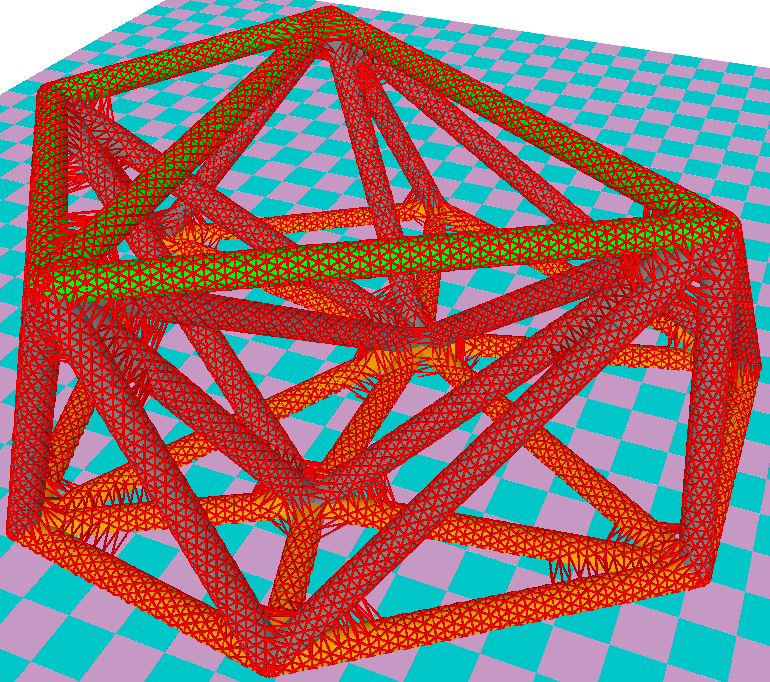

# Delaunay Tetrahedralization Constructions and Smooth Boundary Mesh Rendering

by Quan Yuan and Yu Qu

Nov. 2017

In this project, we create a tetrahedralized structure between two clouds of points
on a pair of paralleled planes respectively, then grow the structure by some radius,
and finally create a high-resolution water-tight triangle mesh that approximates the
boundary of the grown structure.

